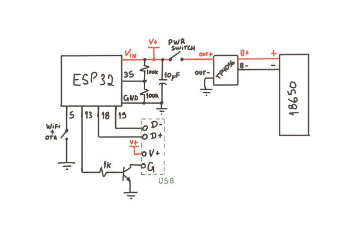
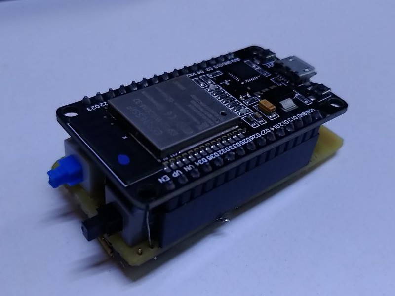
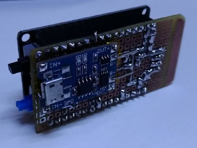
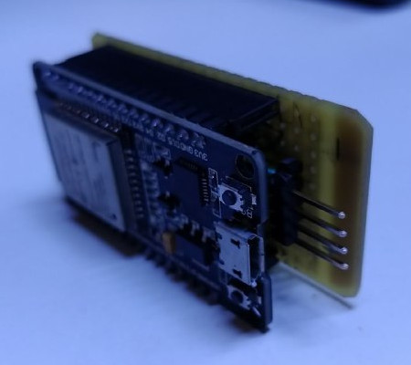

# USB to Bluetooth Keyboard converter

Utilising an ESP32 as data relay from USB-LS (USB Low-Speed software implementation) to Bluetooth.

## Schematic

Below there is a simple schematic for this project.

The idea behind this schematic is to create a device which can be self-powered with a TP4056 + 18650 battery.

The "Wifi + OTA" button should be a momentary switch which is supposed to be held pressed during boot in order to start the WiFi Manager + OTA services.

**ATTENTION:**
- **NEVER power the device through the ESP32 while the POWER SWITCH is on as there's reverse current protection in this schematic.**
- **Pins 5 and 13 were changed to 32 and 4 respectively.**

## Build Images

**NOTE: The header pins used can be easily replaced for a USB-A female conector.**

## Libraries Dependencies

- [ESP32-USBSoftHost](https://github.com/tobozo/ESP32-USB-Soft-Host)
- [WifiManager](https://github.com/tzapu/WiFiManager) 

**NOTE: WifiManager won't support ESP32 on v0.16 release, in order for it to work the MASTER release should be used.**

## Credits
- @sdima1357 for the [USB Soft Host](https://github.com/sdima1357/esp32_usb_soft_host) implementation
- @tobozo for the [USB Soft Host](https://github.com/tobozo/ESP32-USB-Soft-Host) wrapper
- @manuelbl for the [code](https://gist.github.com/manuelbl/66f059effc8a7be148adb1f104666467) that guided the Bluetooth implementation in this project
- @tzapu for the [WifiManager](https://github.com/tzapu/WiFiManager)
